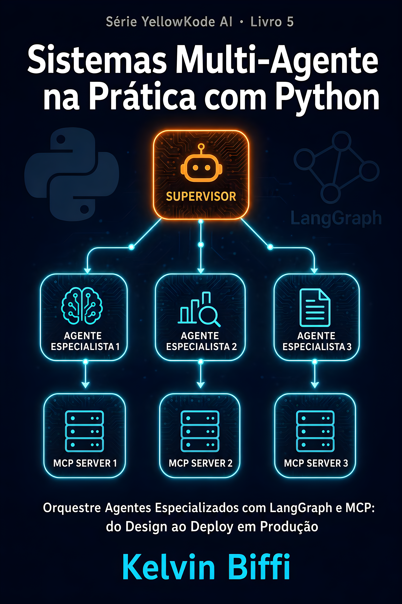

<p align="center">
  
</p>

<h1 align="center">Sistemas Multi-Agente na Prática com Python</h1>

<p align="center">
  Repositório companion do livro publicado por
  <a href="https://github.com/kelvinbiffi">@kelvinbiffi</a>
  e <a href="https://github.com/YellowKode-Academy">@YellowKode-Academy</a>
</p>

<p align="center">
  <a href="https://www.amazon.com.br">Disponível na Amazon KDP</a>
</p>

---

## Sobre este repositório

Contém todo o código Python referenciado no livro, do capítulo 1 ao 12. Cada diretório `cap-XX/` contém o estado do projeto ao final daquele capítulo.

O projeto central do livro é o **market-intelligence-system**: um sistema de inteligência competitiva com três agentes especializados (pesquisa, análise e relatório) coordenados por um supervisor LangGraph. No final, o sistema roda pesquisa e análise em paralelo com o padrão Send() do LangGraph, cada agente tem seu próprio servidor FastMCP dedicado, e tudo roda em produção no Railway com observabilidade completa via Langfuse.

## Setup

```bash
git clone https://github.com/YellowKode-Academy/multiagente-ia-python
cd multiagente-ia-python/cap-01
python -m venv .venv
source .venv/bin/activate
# Windows: .venv\Scripts\activate
pip install -e ".[dev]"
cp .env.example .env
# Edite .env com suas chaves de API
```

## Variáveis de ambiente

Copie `.env.example` para `.env` e preencha:

```
ANTHROPIC_API_KEY=sk-ant-...
TAVILY_API_KEY=tvly-...
LANGFUSE_PUBLIC_KEY=pk-lf-...    # necessário a partir do cap-09
LANGFUSE_SECRET_KEY=sk-lf-...    # necessário a partir do cap-09
RAILWAY_TOKEN=...                 # necessário no cap-12
```

## Onde obter as chaves

| Variável | Onde criar | Plano gratuito |
|---|---|---|
| `ANTHROPIC_API_KEY` | [console.anthropic.com/settings/keys](https://console.anthropic.com/settings/keys) | Não (pay-as-you-go) |
| `TAVILY_API_KEY` | [app.tavily.com](https://app.tavily.com/home) | Sim (1.000 req/mês) |
| `LANGFUSE_PUBLIC_KEY` / `SECRET_KEY` | [cloud.langfuse.com](https://cloud.langfuse.com) → Settings → API Keys | Sim |
| `RAILWAY_TOKEN` | [railway.app/account/tokens](https://railway.app/account/tokens) | Sim (trial $5) |

## Estrutura por capítulo

| Capítulo | Diretório | O que você constrói |
|---|---|---|
| 1 | `cap-01/` | Supervisor Pattern com LangGraph: estado, supervisor e grafo |
| 2 | `cap-02/` | Agente Pesquisa com TavilySearch integrado ao grafo |
| 3 | `cap-03/` | Agente Análise e supervisor determinístico sem LLM |
| 4 | `cap-04/` | Servidor FastMCP dedicado para o agente de pesquisa |
| 5 | `cap-05/` | Servidor FastMCP dedicado para o agente de análise |
| 6 | `cap-06/` | Sistema completo: 3 agentes + 3 servidores MCP |
| 7 | `cap-07/` | Paralelismo com Send(): fan-out determinístico |
| 8 | `cap-08/` | Sincronização com aggregator: fan-in sem condições de corrida |
| 9 | `cap-09/` | Observabilidade completa com Langfuse e Docker Compose |
| 10 | `cap-10/` | Testes unitários, de integração e CI com GitHub Actions |
| 11 | `cap-11/` | Docker Compose com 4 containers e API FastAPI wrapper |
| 12 | `cap-12/` | CI/CD completo com Railway e deploy automático |

## Autor

Criado por [@kelvinbiffi](https://github.com/kelvinbiffi) para a série de livros técnicos da [@YellowKode-Academy](https://github.com/YellowKode-Academy).
